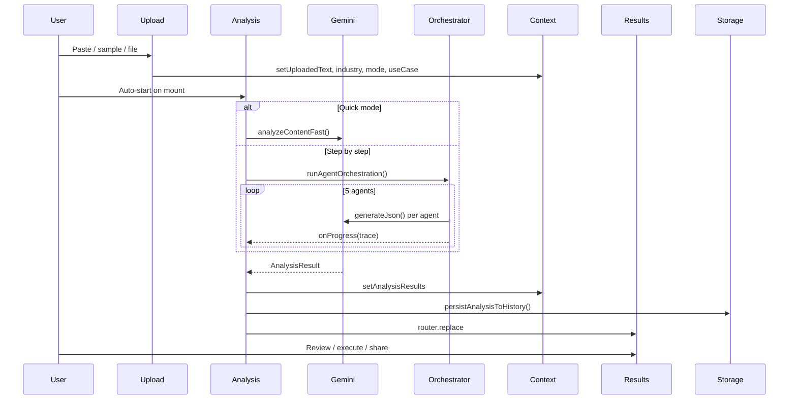

# InsightFlow AI — Developer walkthrough

A structured tour of how InsightFlow AI is built, how data flows through the system, and how each major feature is implemented. Read this after skimming [`README.md`](./README.md).

---

## 1. Product concept

**InsightFlow AI** turns unstructured business documents into an **executive-ready decision package**:

| Stage | What happens |
|-------|----------------|
| **Ingest** | User pastes text or uploads `.txt` / `.pdf` |
| **Analyze** | Gemini extracts insights, risks, and actions (1 or 5 API passes) |
| **Decide** | App surfaces one **autonomous decision** plus advisor debate |
| **Compare** | “Do nothing” vs “act now” consequence framing |
| **Simulate** | Demo execution across Slack, email, CRM, dashboard channels |

The UI is optimized for **hackathon demos** and **mobile-first** use (Expo Go + web).

---

## 2. Repository layout

```
src/
├── app/                    # Routes (Expo Router file-based)
│   ├── _layout.tsx         # Root: ThemeProvider, AppProvider, Stack
│   ├── settings.tsx        # Modal: API test, reset, history clear
│   └── (tabs)/
│       ├── _layout.tsx     # Bottom tabs + onboarding gate
│       ├── index.tsx       # Home dashboard
│       ├── upload.tsx      # Document input & options
│       ├── analysis.tsx    # Live analysis + agent trace
│       ├── results.tsx     # Full decision report UI
│       └── history.tsx     # Past runs list
├── components/             # Presentational & feature UI
├── constants/              # Tokens, copy, agents, samples
├── context/AppContext.tsx  # Global session state
├── services/               # AI, storage, documents
├── types/                  # TypeScript contracts
└── utils/                  # Pure helpers (format, debate, haptics)
```

**Path alias:** `@/*` → `src/*` (see `tsconfig.json`).

---

## 3. Navigation & app shell

### 3.1 Root layout (`src/app/_layout.tsx`)

- Wraps the app in React Navigation **dark theme** (custom cyan/emerald accents)
- **`AppProvider`** supplies global state
- **Stack** navigator: `(tabs)` group + **Settings** modal

### 3.2 Tabs layout (`src/app/(tabs)/_layout.tsx`)

Five tabs with **guard listeners**:

| Tab | Route | Guard behavior |
|-----|-------|----------------|
| Home | `/` | Always open |
| Upload | `/upload` | Always open |
| Analysis | `/analysis` | Redirects to Upload if no document text |
| Results | `/results` | Redirects to Upload or Analysis if no results |
| History | `/history` | Redirects to Upload if history empty |

**OnboardingModal** shows until `appPreferences` marks onboarding complete.

### 3.3 AppScreen (`src/components/AppScreen.tsx`)

Shared full-screen wrapper:

- Dark gradient background
- Decorative orbs (non-interactive)
- `SafeAreaView` for notch/home indicator

---

## 4. Global state (`AppContext`)

**File:** `src/context/AppContext.tsx`

| State | Purpose |
|-------|---------|
| `uploadedText` | Raw document for analysis |
| `sourceFileName` | Optional file label from picker |
| `industry` | `general` \| `finance` \| `healthcare` \| `technology` |
| `analysisMode` | `fast` (default) \| `full` |
| `useCase` | `board` \| `crisis` \| `weekly` |
| `analysisResults` | Latest `AnalysisResult` object |
| `isAnalyzing` | Blocks duplicate runs |
| `history` | Array of `HistoryEntry` (max 20) |

**Key actions:**

- `persistAnalysisToHistory()` — saves after successful analysis (called from Analysis before navigating to Results)
- `loadHistoryEntry(entry)` — hydrates text + results from a past run
- `resetSession()` — clears in-progress upload/results
- `clearHistory()` / `removeHistoryEntry(id)` — storage management

Preferences (`useCase`, onboarding flag) live in `src/services/appPreferences.ts` (AsyncStorage).

---

## 5. Data model

### 5.1 `AnalysisResult` (`src/types/analysis.ts`)

The central object returned by Gemini and rendered on Results:

```typescript
// Conceptual shape — see types/analysis.ts for full definition
{
  executiveSummary, urgencyHeadline, stakeAtRisk,
  doNothingOutlook, doActionOutlook,
  riskScore, confidence, priorityLevel, estimatedImpact,
  keyFindings[], riskAssessment[], recommendedActions[],
  impactMetricLabel, beforeMetric, afterMetric,
  simulatedActions[], executionLog[],
  agentTrace[],
  autonomousDecision?, decisionScores?, agentDebate?
}
```

### 5.2 Agents (`src/types/agents.ts`, `src/constants/agents.ts`)

Five pipeline agents (user-facing names):

| ID | UI name | Role |
|----|---------|------|
| `ingestion` | Reader | Document type + key signals |
| `insight` | Main Points | Executive summary + findings |
| `risk` | Problems | Risk score, assessment, urgency |
| `action` | Next Steps | Recommended actions |
| `execution` | Results | Metrics, simulated actions, autonomous decision, debate |

`AgentTraceEntry` records `status`, `reasoning`, `outputSummary`, timestamps per step.

---

## 6. AI layer

### 6.1 Gemini service (`src/services/gemini.ts`)

**Responsibilities:**

- Load `EXPO_PUBLIC_GEMINI_API_KEY`
- **Model pool** with fallbacks (`gemini-flash-lite-latest` default)
- Fetch available models from Google API (`/v1beta/models`)
- Retry with exponential backoff on transient errors
- Friendly error mapping (invalid key, quota, access denied, overload)
- **`analyzeContentFast()`** — one JSON-mode prompt → full `AnalysisResult`
- **`generateJson()`** — used by orchestrator agents
- **`extractTextFromPdf()`** — multimodal PDF → plain text
- **`generateExecutiveBrief()`** — 4 presentation bullets
- **`probeGeminiApi()`** — health check for Settings

**Plain-language rules:** `PLAIN_LANGUAGE_AI_RULES` in `src/constants/plainLanguage.ts` is injected into every prompt so outputs stay simple and non-jargony.

### 6.2 Agent orchestrator (`src/services/agentOrchestrator.ts`)

**`runAgentOrchestration(text, industry, onProgress, useCase)`**

Runs five sequential agent functions:

1. `runIngestionAgent`
2. `runInsightAgent`
3. `runRiskAgent`
4. `runActionAgent`
5. `runExecutionAgent`

Each agent:

- Updates `AgentTraceEntry` to `running` → `complete` (or `error`)
- Calls `generateJson()` with a focused prompt and document excerpt
- Passes prior agent outputs forward (e.g. signals → insight → risk)

Final return merges insight + risk + action + execution into one `AnalysisResult`.

### 6.3 Analysis screen wiring (`src/app/(tabs)/analysis.tsx`)

```
uploadedText present?
    → startAnalysis()
        → full mode: runAgentOrchestration + live setAgentTrace
        → fast mode: analyzeContentFast + simulated progress on timeline
    → on success: setAnalysisResults, persistAnalysisToHistory
    → auto router.replace('/results') after 1.2s
    → on error: toFriendlyGeminiError + Retry button
```

**UX details:**

- `AgentWorkflowTimeline` + `AgentWorkflowTerminal` always visible during run
- Fast mode animates progress across five visual steps without five API calls
- `lastRunKey` prevents duplicate auto-runs for same text/mode/useCase

---

## 7. Document ingestion

### 7.1 Upload screen (`src/app/(tabs)/upload.tsx`)

- **Text area** for paste (min length `MIN_CONTENT_LENGTH` = 80 chars)
- **Try sample report** → `SAMPLE_REPORT` from `src/constants/sampleReport.ts`
- **File picker** → `pickAndExtractDocument()` in `src/services/document.ts`
- **Industry** chips, **Use case** picker, **Analysis mode** picker
- Resume detection tip via `looksLikeResume()` when content looks like a CV

### 7.2 Document service (`src/services/document.ts`)

- Uses `expo-document-picker` for `.txt` / `.pdf`
- PDF: reads base64 via `expo-file-system`, sends to `extractTextFromPdf()`

---

## 8. Results experience

**File:** `src/app/(tabs)/results.tsx`

Scroll structure (jump nav anchors):

| Section ID | Component | Purpose |
|------------|-----------|---------|
| `alert` | `ExecutiveAlertHeader` | Urgency headline + stake |
| `decision` | `AutonomousDecisionCenter` | Primary action, reason, outcome |
| `compare` | `ExecutivePathCompare` | Do-nothing vs act paths |
| `actions` | `RecommendedActionCards` + `ActionCommander` | Supporting actions + execute simulation |
| `trace` | `AgentTracePanel` | Collapsible agent log |
| `more` | Debate, scorecard, voice, replay | Deep-dive tools |

**Sticky footer:** Share, Copy, New report link.

### 8.1 Action commander (`src/components/ActionCommander.tsx`)

- Lists `simulatedActions` from AI (Slack, email, CRM, dashboard)
- User toggles approvals → **Execute** runs staged animations + notification previews
- **Demo only** — no outbound HTTP

### 8.2 AI debate (`src/components/AIDebateMode.tsx`)

Renders Growth / Risk / Finance cards + final conclusion. Data from `agentDebate` on result, or computed fallback in `src/utils/agentDebate.ts`.

### 8.3 Decision scorecard (`src/components/AIDecisionScorecard.tsx`)

Five bars 0–100. Uses `decisionScores` from AI or `getDecisionScorecardScores()` heuristic.

### 8.4 Voice brief (`src/components/ExecutiveVoiceBriefing.tsx`)

Calls `generateExecutiveBrief()` then `expo-speech` for TTS.

### 8.5 Workflow replay (`src/components/AutonomousWorkflowReplay.tsx`)

Steps through `agentTrace` entries with play/pause UX.

---

## 9. History & persistence

**File:** `src/services/historyStorage.ts`

- Key: `@insightflow/history`
- Max **20** entries, newest first
- Each `HistoryEntry` stores: id, timestamp, industry, mode, title preview, full `documentText`, `results`

**History screen** (`history.tsx`): list → tap → `loadHistoryEntry` → navigate to Results.

---

## 10. UI system

### 10.1 Design tokens (`src/constants/designTokens.ts`)

- `colors`, `spacing`, `radius`, `shadows`, `screenContent`, `buttonMetrics`
- `shadows` use `platformStyles.platformShadow()` for web `boxShadow` compatibility

### 10.2 Core components

| Component | Role |
|-----------|------|
| `Typography` | Variant-based text (hero, section, alert, terminal, …) |
| `Button` | Primary gradient CTA, secondary, danger, ghost; press scale + haptics |
| `Card` | Elevated surfaces, optional glow when active |
| `SectionHeader` | Title + hint pattern |
| `AnimatedEntrance` | Staggered list entrance |
| `PressableScale` | Micro-interaction on tappable rows |
| `GlowBorder` | Animated ring on active/running elements |
| `ConfirmDialog` | Replaces system alerts in Settings |

Copy is centralized in **`UI`** object (`src/constants/plainLanguage.ts`) for consistent product language.

---

## 11. Cross-cutting utilities

| File | Role |
|------|------|
| `formatReport.ts` | Plain-text report for Share/Copy |
| `agentDebate.ts` | Parse/normalize debate JSON |
| `decisionScorecard.ts` | Scorecard from AI or heuristics |
| `haptics.ts` | Light/medium haptics on key actions (native) |
| `microAnimations.ts` | Shared spring configs |
| `platformStyles.ts` | Web-safe shadows |

---

## 12. Configuration files

| File | Role |
|------|------|
| `app.json` | Expo app name, slug, dark UI, static web output, plugins |
| `metro.config.js` | Default Expo Metro bundler |
| `babel.config.js` | Expo Babel preset |
| `eslint.config.js` | `eslint-config-expo` |
| `.env` / `.env.example` | Gemini API key (not committed) |

---

## 13. End-to-end sequence diagram



---

## 14. Extension points (for future devs)

| Goal | Where to start |
|------|----------------|
| New industry | `INDUSTRY_CONTEXT` in `gemini.ts` + `INDUSTRY_OPTIONS` in `types/analysis.ts` |
| New agent in pipeline | `AGENT_PIPELINE`, orchestrator agent function, `CINEMATIC_WORKFLOW` |
| Real Slack/email | Replace simulation in `ActionCommander` with API routes + secrets (server-side) |
| Cloud history | Swap `historyStorage.ts` for Supabase/Firestore |
| New results section | `results.tsx` `ScrollSection` + `ResultsJumpNav` ids |
| Stricter AI output | Extend `PLAIN_LANGUAGE_AI_RULES` and JSON schema in `ANALYSIS_PROMPT` |

---

## 15. Related docs

- **Run locally:** [`instructions.md`](./instructions.md)
- **GitHub overview:** [`README.md`](./README.md)
- **Live demo script:** [`DEMO_SCRIPT.md`](./DEMO_SCRIPT.md)
- **Visual design:** [`DESIGN_SYSTEM.md`](./DESIGN_SYSTEM.md)
- **Expo 55 reference:** [Expo docs v55](https://docs.expo.dev/versions/v55.0.0/) (see `AGENTS.md`)

---

## 16. Mental model (one paragraph)

InsightFlow is a **thin client** over Gemini: the “intelligence” lives in prompts and orchestration (`gemini.ts` + `agentOrchestrator.ts`), while React Native screens **visualize** the structured `AnalysisResult` and **simulate** execution for storytelling. State is session-oriented (`AppContext`) with lightweight persistence (`historyStorage`). The hackathon value is the **visible multi-agent trace**, **single autonomous decision**, and **consequence + action** narrative—not hidden magic in one prompt.
